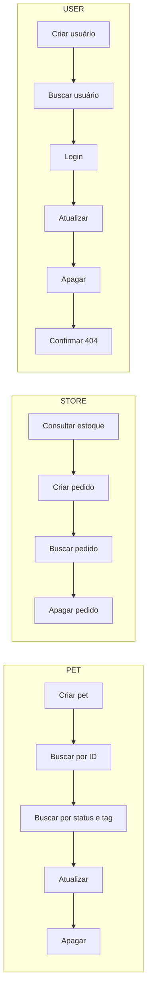

<h1 align="center">🐾 Petstore API Testing</h1>

<p align="center">
  Testes automatizados de API REST com <b>Postman</b> e <b>Newman</b>, cobrindo o fluxo completo da API pública Swagger Petstore.
</p>

<p align="center">
  
  
  
  
  
</p>

<p align="center">
  
  
  
</p>

---

## 📋 Sobre o projeto

Collection Postman que testa de ponta a ponta os três recursos da [Swagger Petstore](https://petstore.swagger.io): **pets**, **pedidos** e **usuários**. As requests usam variáveis de ambiente, autenticação por API Key e Bearer Token, e cada uma tem testes automatizados em JavaScript, incluindo cenários de erro.

A collection roda inteira pelo terminal com o **Newman**, que gera um relatório HTML com o resultado de cada teste.

## ✨ Destaques

- 🔁 **Fluxo de ponta a ponta:** cada recurso é criado, consultado, alterado e apagado, e no fim o teste confirma que ele não existe mais.
- 🧪 **110 testes automatizados:** status code, contrato (tipos e campos obrigatórios) e valores de retorno.
- ❌ **Cenários negativos:** respostas 400, 404 e 500 validadas.
- 🌎 **Nada fixo no código:** URL, IDs e credenciais vêm de um ambiente.
- 🔐 **Dois tipos de autenticação:** API Key para a collection inteira e Bearer Token capturado dinamicamente do login.
- 🤖 **Execução por linha de comando:** Newman com relatório HTML, pronto para rodar em pipelines de CI.

## 🔄 Fluxo dos testes



## 🧪 Cobertura de testes

| Recurso | Requests | Métodos | O que é validado |
|---|:---:|---|---|
| 🐶 **Pet** | 8 | `GET` `POST` `PUT` `DELETE` | Cadastro, busca por ID, status e tag, atualização (JSON e formulário), remoção e JSON inválido (400) |
| 🛒 **Store** | 4 | `GET` `POST` `DELETE` | Estoque, criação, consulta e remoção de pedido |
| 👤 **User** | 7 | `GET` `POST` `PUT` `DELETE` | Cadastro, consulta, login com captura de token, atualização, remoção, dado inválido (500) e usuário inexistente (404) |

## 🔐 Autenticação

| Tipo | Onde | Como funciona |
|---|---|---|
| **API Key** | Collection inteira | Header `api_key` com o valor de `{{apiKey}}`, herdado por todas as requests |
| **Bearer Token** | Atualizar e apagar usuário | O token é extraído da resposta do login e salvo em `{{sessionToken}}` por um script |

```javascript
// Captura do token no teste do login
const token = pm.response.json().message.split(':')[1];
pm.environment.set("sessionToken", token);
```

## 📁 Estrutura

```
📦 petstore-api-testing
 ┣ 📜 petstore-semana1.postman_collection.json   → collection com requests e testes
 ┣ 📜 petstore.postman_environment.json          → variáveis do ambiente
 ┣ 📜 relatorio-newman.html                      → relatório da última execução
 ┗ 📜 README.md
```

## 🚀 Como executar

### Pré-requisitos
- [Node.js](https://nodejs.org) (versão LTS)

### Pelo terminal (Newman)

```bash
# 1. Clone o repositório
git clone <link-deste-repositório>
cd <nome-da-pasta>

# 2. Instale o Newman e o gerador de relatório
npm install -g newman newman-reporter-htmlextra

# 3. Rode os testes
newman run petstore-semana1.postman_collection.json \
  -e petstore.postman_environment.json \
  -r cli,htmlextra
```

O relatório HTML é gerado na pasta `newman/`.

### Pelo Postman
1. Clique em **Import** e arraste os dois arquivos `.json`.
2. Selecione o ambiente **Petstore** no canto superior direito.
3. Na collection, clique em **Run**.
Link do 
## 📊 Resultado


[Link do Postman](https://www.postman.com/gabrielazeni-1621293/api-testing-postman-newman/collection/hclng56/swagger-petstore)
 
## ⚠️ Observação

A Petstore é uma API pública de demonstração, compartilhada por todos os que a usam. Ela aceita qualquer API Key ou token, e outras pessoas podem alterar os mesmos registros ao mesmo tempo. Se algum teste falhar de forma isolada, rode de novo ou troque `petId` e `userId` no ambiente.

## 👤 Autor

**Gabriela Kaenna Zeni Navarro Lins**
[LinkedIn](https://www.linkedin.com/in/gabrielazenilins/) · [GitHub](https://github.com/gabrielazenilins)
